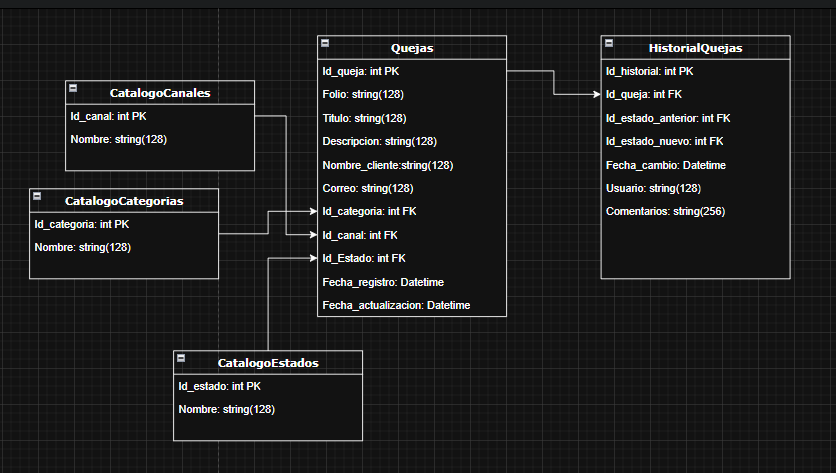

# 🚀 Sistema de Gestión de Quejas V2026

Solución para el registro, seguimiento y administración de quejas diseñada para áreas operativas de TI.

## 🗄️ Estructura de la Base de Datos


### Características
* **Dashboard:** Filtros por folio y estado de la queja.
* **Gestión de Estados:** Flujo lógico de estados (Registrada -> Análisis -> Resuelta -> Cerrada).
* **Validación de Reglas de Negocio:** Implementadas en el Backend para asegurar la integridad de los datos.
* **Arquitectura Limpia:** Separación de responsabilidades (Web API + Frontend desacoplado).

## 🛠️ Stack Tecnológico
* **Backend:** .NET 10.0.3 Web API (C#)
* **Base de Datos:** SQL Server + Entity Framework Core
* **Frontend:** JavaScript, HTML5, Bootstrap 5
* **Herramientas:** Git, GitHub, Swagger

## ⚙️ Guía de Instalación

### 1. Base de Datos
* Localiza el script SQL en la carpeta `/SistemaGestorQuejasBD`.
* Ejecútalo en tu instancia de SQL Server para crear las tablas y datos semilla.

### 2. Backend (API)
* Abre la solución en Visual Studio 2022.
* Revisa el `appsettings.json` y ajusta tu `ConnectionString`.
* Ejecuta el proyecto (Puerto predeterminado: 5045).

### 3. Frontend
* Abre el archivo `index.html` ubicado en `/Quejas.Web`, directamente en el navegador o usa la extensión "Live Server" en VS Code.

## ⚠️ Configuración de la API (Frontend)
Para que el Frontend se comunique correctamente con la API, asegúrate de que la URL en `script.js` coincida con la de tu servidor local:

1. Inicia el proyecto Backend en Visual Studio.
2. Copia la URL base (ej: `http://localhost:5045`).
3. Abre `Frontend/script.js` y actualiza la constante al inicio del archivo:

```javascript
const API_URL = 'http://localhost:5045/api/Quejas';
